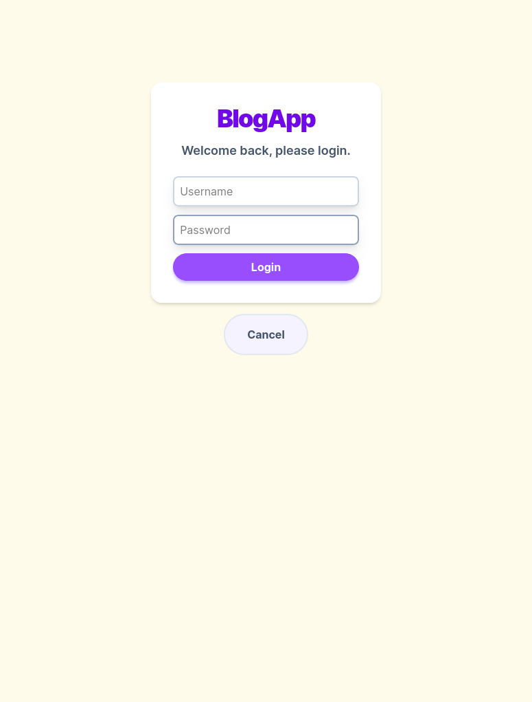
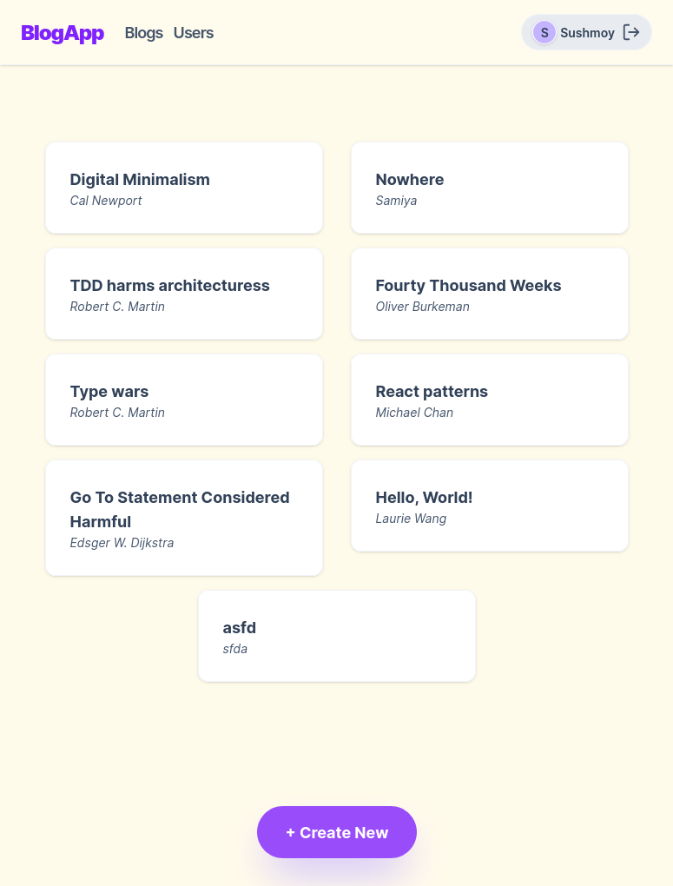
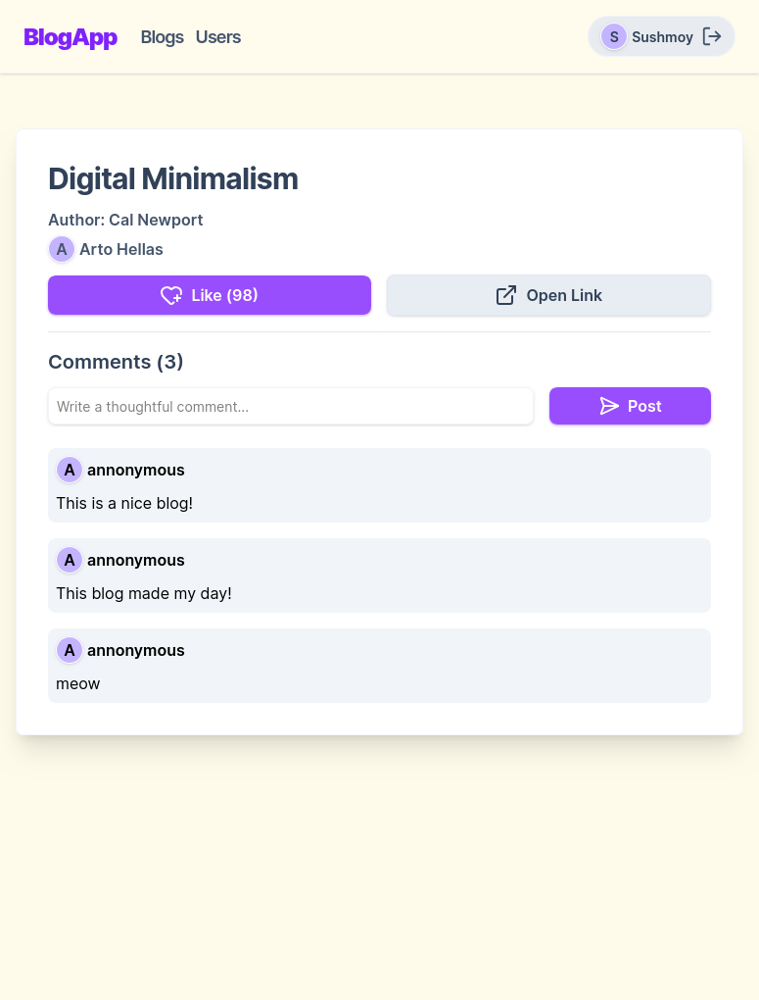
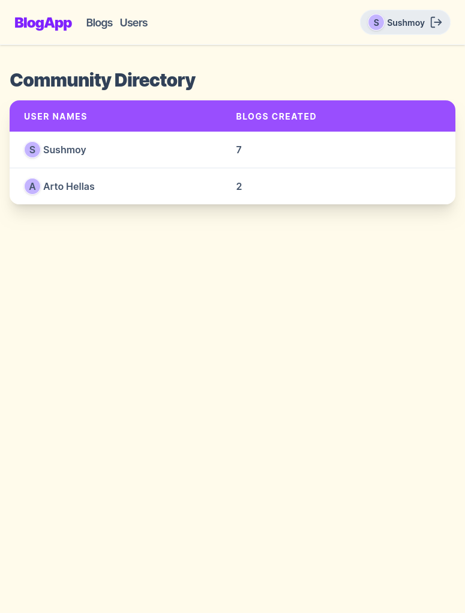

# Bloglist Application
A full-stack web application for saving, sharing, and interacting with favorite blog posts, built as part of the *Full Stack Open* curriculum. This project demonstrates end-to-end web development, from robust RESTful API design to a responsive frontend.

---

## Features
- User Authentication (Signup/Login)
- Add, View, and Delete Blogs
- Interactive "Like" System
- User-Specific Blog Dashboards
- Token-Based Route Protection

## Tech Stack
- **Frontend:** React, React Router, Redux/React Query
- **Backend:** Node.js, Express.js
- **Database:** MongoDB & Mongoose
- **Testing:** Jest, Supertest (Backend), Cypress (E2E)

## Architecture & Design

* **Clean API Architecture:** Backend routes and controllers are strictly separated from database schemas, ensuring a stable and maintainable codebase.
* **State & Data Fetching:** Centralized state management for user sessions and cached data fetching to minimize unnecessary network requests.
* **Robust Error Handling:** Express middleware catches and standardizes API errors before they reach the client, providing clear UI feedback.
* **Comprehensive Testing Pipeline:** Verified through isolated unit tests for logic, integration tests for API endpoints, and end-to-end testing for critical user journeys.

## Screenshots

| Login | Main Feed | Single Blog | Users |
| :---: | :---: | :---: | :---: |
|  |  |  |  |

## Installation & Setup

### 1. Backend Setup
1.  **Clone the repository and navigate to the backend:**
    ```bash
    git clone <your-repo-link>
    cd bloglist-app/backend
    ```
2.  **Install dependencies:**
    ```bash
    npm install
    ```
3.  **Environment Configuration:**
    Create a `.env` file in the `backend` directory:
    ```env
    PORT=3003
    MONGODB_URI=<YOUR_MONGODB_URI>
    TEST_MONGODB_URI=<YOUR_TEST_MONGODB_URI>
    SECRET=<YOUR_JWT_SECRET>
    ```
4.  **Start the server:**
    ```bash
    npm run dev
    ```

### 2. Frontend Setup
1.  **Navigate to the frontend directory:**
    ```bash
    cd ../frontend
    ```
2.  **Install dependencies:**
    ```bash
    npm install
    ```
3.  **Start the application:**
    ```bash
    npm run dev
    ```